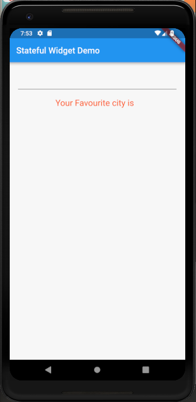
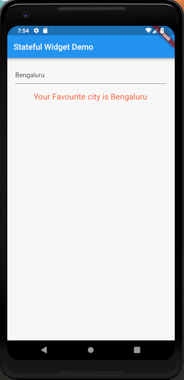

# Stateful_widgets

A new Flutter project which explains how to use Stateful Widgets in Flutter.

## Steps to use Stateful Widgets

* Create a class that extends a "StatefulWidget" that returns a state in createState()

``` 

class MyApp extends StatefulWidget {
  @override
  State<StatefulWidget> createState() {
    return _MyApp();
  }
}

```

* Create a "State" class which has widgets that may change.

```

class _MyApp extends State<MyApp> {
  String name = " ";
  @override
  Widget build(BuildContext context) {
    return Container(
      padding: EdgeInsets.all(20.0),
      child: Column(
        children: <Widget>[
          TextField(
            onSubmitted: (String string) {
              setState(() {
                name = string;
              });
            },
          ),
          Padding(
            padding: EdgeInsets.only(top:20.0),
            child: Text("Your Favourite city is $name",
            style: TextStyle(
              fontSize: 20.0,
              color: Colors.deepOrange
            ),),
          )
        ],
      ),
    );
  }
}

```

<hr>

 